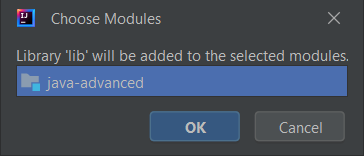

# java-advanced-windows-setup

Здесь представлена инструкция, вдохновленная [другой инструкцией](https://telegra.ph/Kak-podgotovitsya-k-JavaAdvanced-02-16), дополненная лишь ещё несколькими методами запуска на операционной системе Windows. Ниже приведены следующие виды запусков:

* компиляция и запуск через классы на Windows (локально);
* компиляция на Windows и запуск через классы на Ubuntu (по SSH-ключу);
* компиляция и запуск через тестирующие `jar`-файлы на Windows (локально, git bash);
* компиляция и запуск через тестирующие `jar`-файлы на подсистеме Windows для Linux (локально, terminal).

## Компиляция и запуск через классы на Windows

1. Скачайте и установите [JetBrains Intellij IDEA](https://www.jetbrains.com/ru-ru/idea/download/#section=windows) и [JDK17+](https://adoptium.net/).
2. Создайте пустой проект *java-advanced* (здесь и далее будем считать, что проект имеет такое название).
    * В поле **Name** введите название проекта.
    * В поле **Location** выберете место, куда Вы хотите положить проект.
    * В **Language** выставите, если не выставлено, `Java`.
    * В **Build system** выставите, если не выставлено, `Intellij`.
    * Снимите галочку с `Add sample code`.
    * В созданном проекте удалите директорию `src/`.
    
3. Склонируйте Git-репозитории.
    * Зайдите в директорию проекта.
    * C командной строки склонируйте Git-репозиторий с тестами и персональный репозиторий.
    * Для удобства переименуйте репозиторий с тестам в `tests/`, персональный же - `solutions/` (здесь и далее будем считать, что директории называются именно так).
    
4. Пометьте директории проекта.
    * Директорию `tests/lib/` пометьте как *Resources Root*.
    
    * Директорию `solutions/java-solutions/` - *Sources Root*.
5. Импортируйте библиотеку и модули.
    * Зайдите в структуру проекта (`File` -> `Project Structure...`).
    * Во вкладке `Project Settings` выберите `Libraries`.
        * Нажмите на плюсик.
        * В появившемся окне нажмите `Java`.
        
        * Выберите директорию `tests/lib/`.
        * В появившемся окне нажмите `OK`.
        
    * Во вкладке `Project Settings` выберите `Modules`.
        1. Выберите под наименованием модуля `Dependencies`.
        2. Нажмите на верхний плюсик.
        3. В появившемся окне нажмите `Import Module`.
        
        4. Выберите директорию `tests/modules/info.kgeorgiy.java.advanced.base`.
        5. В появляющихся окнах подтвердите создание.
        6. Добавьте еще один модуль `tests/modules/info.kgeorgiy.java.advanced.walk` и повторите действия пунктов **`a`**-**`e`**.
    * *For future*: Все остальные модули добавляются также по предыдущему пункту.
6. Настройте зависимости модулей.
    1. Настройка базового модуля.
        * Выберите модуль `info.kgeorgiy.java.advanced.base`.
        * В окне правее нажмите плюсик.
        * В появившемся окне нажмите `Library`.
        
        * Выберите добавленный ранее `lib`.
    2. Настройка модуля первого домашнего задания.
        * Выберите модуль `info.kgeorgiy.java.advanced.walk`.
        * В окне правее нажмите плюсик.
        * В появившемся окне нажмите `Library`.
        * Выберите добавленный ранее `lib`.
        * Нажмите снова на плюсик и выберите `Module Dependency...`.
        
        * В появившемся окне выберите модуль `info.kgeorgiy.java.advanced.base`.
    3. Настройка общего модуля.
        * Выберите модуль `java-advanced`.
        * Добавьте в зависимости все существующие модули, кроме модуля `info.kgeorgiy.java.advanced.base`, иначе будут проблемы при компиляции.
        
    4. *For future*: Все остальные модули добавляются также по пунктам **`ii`** и **`iii`**. *Обратите внимание*: для некоторых модулей понадобятся другие модули, помимо `info.kgeorgiy.java.advanced.base`.
7. Добавьте конфигурацию запуска.
    * В поле **Name** введите название конфигурации, например, *ClassWalkTestWindows*, где префикс *Class* означает, что тесты компилируются и запускаются через классы; *WalkTest* - версия домашнего задания (easy/hard/bonus); суффикс *Windows* - тесты проходят на Windows.
    * В поле `module not specified` выберите версию JDK.
    * В поле `-cp <no module>` выберите модуль `java-advanced`.
    * В поле **Main class** введите полное название класса тестирования, например, *info.kgeorgiy.java.advanced.walk.Tester*.
    * В поле **Program arguments** введите первым аргументом версию домашнего задания, вторым - полное название разработанного класса, например, *Walk info.kgeorgiy.ja.bakturin.walk.Walk*.
    

## Компиляция на Windows и запуск через классы на Ubuntu

1. Скачайте и установите [VirtualBox](https://www.virtualbox.org/wiki/Download_Old_Builds_6_1) и скачайте образ диска [Ubuntu Server](https://ubuntu.com/download/server).
2. Установка операционной системы Ubuntu Server.
    * Создание новой машины, **`New`**.
        * В поле **Name** введите имя машины, например, *JRunner*.
        * В поле **Type** выберите тип `Linux`.
        * В поле **Version** выставите `Ubuntu (64-bit)` или `Ubuntu (32-bit)`.
        
    * Далее нажимаете всё время `Next`. Из интересного стоит отметить, что количество места для операционной системы - хватает и 10 ГБ (утверждается, что можно поставить чуть поменьше). Также, по умолчанию, на операционную систему будет приходиться 1 ГБ оперативной памяти.
    * Настройка виртуальной машины, **`Settings`**. В разделе *Storage*, в *Empty* нажмите на значок *диска* - *Choose a disk file* - выберите скачанный `.iso`.
    
    * Запуск виртуальной машины., **`Start`**. В разделе *Guided storage configuration* рекомендуется убрать пункт `Set up this disk as an LVM group`.
    
    * Во всех оставшихся разделах нажимаете всё время `Next`, создайте пользователя и ничего лишнего не выбирайте для экономия места и времени.
    
3. Обновление операционной системы. Введите в терминале следующее:

    ```bash
    sudo apt-get update
    sudo apt-get upgrade -y
    ```

4. Установите все необходимые для дальнейшей работы *зависимости*:

    ```bash
    sudo apt-get install -y openjdk-17-jdk-headless net-tools openssh-server
    ```

    
5. Выключите виртуальную систему (желательно, через команду `poweroff`) и зайдите в настройки: в разделе *Network* перед **Attached to** разверните список и выберите `Host-only Adapter`, это нужно, для того, чтобы IP-адрес, по которому будет якобы располагаться наш сервер, никогда не менялся, при этом, доступ к Интернету на виртуальной машине Вы потеряете.

6. Запустите машину и после входа в терминал введите следующее

    ```bash
    ifconfig
    ```

    Чуть ниже на одну строку и левее надписи `enp0s3` Вы увидите IP-адрес после надписи `inet`. Запомните его.
    
7. Добавьте конфигурацию запуска.
    * В поле **Name** введите название конфигурации, например, *ClassWalkTestLinux*, где префикс *Class* означает, что тесты компилируются и запускаются через классы; *WalkTest* - версия домашнего задания (easy/hard/bonus); суффикс *Linux* - тесты проходят на Linux (Ubuntu Server).
    
    * Напротив **Run on** выберите `SSH`.
        * В появившемся окне, в поле **Host** введите IP-адрес виртуальной машины, в поле **Username** - заданный на этапе установки системы *username* для входа в систему.
        
        * Если появилось окно, что до SSH-сервера якобы нельзя достучаться, значит, есть шанс, что Вы всё сделали правильно.
        
        * В поле **Password** введите пароль от *username* для входа в систему.
        
        * После успешной проверки наличия JDK нажмите `Next`.
        
        * Установите себе все необходимые директории или оставьте по умолчанию.
        
    * В поле `module not specified` выберите версию JDK.
    * В поле `-cp <no module>` выберите модуль `java-advanced`.
    * В поле **Main class** введите полное название класса тестирования, например, *info.kgeorgiy.java.advanced.walk.Tester*.
    * В поле **Program arguments** введите первым аргументом версию домашнего задания, вторым - полное название разработанного класса, например, *Walk info.kgeorgiy.ja.bakturin.walk.Walk*.
    
8. Для запуска системы *JRunner* без интерфейса можно воспользоваться скриптом [`JRunner.cmd`](JRunner.cmd). *Обратите внимание*, что в скрипте в качестве пути к программе выбран путь по умолчанию.

## Компиляция и запуск через тестирующие `jar`-файлы на Windows

1. Скачайте и установите [Git Bash](https://git-scm.com/).
2. Добавьте в директорию проекта скрипт [`Test.sh`](Test.sh).
3. Отредактируйте файл под Вашу настройку проекта:
    * В поле **`SOLUTIONS`** введите путь-директорию к персональному репозиторию, то есть тот, по которому лежит `java-solutions`.
    * В поле **`TESTS`** введите путь-директорию к репозиторию с тестами, то есть тот, по которому лежат `artifacts/`, `lib/`, `modules/`.
    * В поле **`SURNAME`** введите Вашу фамилию, то есть то, что Вы подставляли вместо *\_\_last_name\_\_*.
4. Добавьте конфигурацию запуска.
    * В поле **Name** введите название конфигурации, например, *JarWalkTestGitBash*, где префикс *Jar* означает, что тесты компилируются и запускаются через `.jar`; *WalkTest* - версия домашнего задания (easy/hard/bonus); суффикс *GitBash* - тесты проходят через приложение Git Bash.
    * В поле `Script path` укажите путь до файла *Test.sh*.
    * В поле `Script options` укажите аргументы к скрипту:
        1. Название пакета, в котором лежит Ваше решение домашнего задания.
        2. Название пакета, в котором лежат тесты к домашнему заданию.
        3. Чистое название класса, являющийся Вашим решением домашнего задания, то есть, например, `Walk` или `RecursiveWalk`.
        4. Название версии тестирования домашнего задания (easy/hard/bonus).
    

## Компиляция и запуск через тестирующие `jar`-файлы на подсистеме Windows для Linux

1. Активируйте компоненты Windows.
    * Откройте *Панель управления* - *Все элементы панели управления* - *Программы и компоненты* - ***Включение и отключение компонентов Windows***.
    * В списке найдите пункт ***Подсистема Windows для Linux*** и убедитесь, что перед пунктом стоит галочка. В ином случае: поставьте, сохраните изменения и перезагрузите компьютер.
2. В Microsoft Store установите приложение ***Подсистема Windows для Linux***.
3. Запустите терминал/командную строку, введите следующее ниже и перезагрузите компьютер:

    ```cmd
    wsl.exe --update
    wsl.exe --set-default-version 2
    ```

4. По пути домашнего каталога текущего пользователя должен появиться файл `.wslconfig`, в котором лежат основные глобальные настройки для WSL2. Содержимое `.wslconfig` предлагается установить следующим:

    ```config
    [wsl2]
    nestedVirtualization=true
    memory=512MB
    processors=2
    ```

    Первые две строки должны быть по умолчанию после установки версии WSL на 2. Значение `memory` ограничивает подсистеме использование оперативной памяти, `processors`, соответственно, на количество процессоров.
5. В Microsoft Store установите приложение ***Ubuntu 20.04.6 LTS***, запустите его, проследуйте инструкциям установки и введите в терминал:

    ```bash
    sudo apt-get update
    sudo apt-get upgrade -y
    sudo apt-get install -y openjdk-17-jdk-headless
    ```

6. Добавьте в директорию проекта скрипты [`Test.sh`](Test.sh) и [`TestWSL.cmd`](TestWSL.cmd).
7. Отредактируйте файл под Вашу настройку проекта:
    * В поле **`SOLUTIONS`** введите путь-директорию к персональному репозиторию, то есть тот, по которому лежит `java-solutions`.
    * В поле **`TESTS`** введите путь-директорию к репозиторию с тестами, то есть тот, по которому лежат `artifacts/`, `lib/`, `modules/`.
    * В поле **`SURNAME`** введите Вашу фамилию, то есть то, что Вы подставляли вместо *\_\_last_name\_\_*.
8. Добавьте конфигурацию запуска.
    * В поле **Name** введите название конфигурации, например, *JarWalkTestWSL*, где префикс *Jar* означает, что тесты компилируются и запускаются через `.jar`; *WalkTest* - версия домашнего задания (easy/hard/bonus); суффикс *WSL* - тесты проходят через подсистему.
    * В поле `Script path` укажите путь до файла *TestWSL.cmd*.
    * В поле `Script options` укажите аргументы к скрипту:
        1. Название пакета, в котором лежит Ваше решение домашнего задания.
        2. Название пакета, в котором лежат тесты к домашнему заданию.
        3. Чистое название класса, являющийся Вашим решением домашнего задания, то есть, например, `Walk` или `RecursiveWalk`.
        4. Название версии тестирования домашнего задания (easy/hard/bonus).
    
